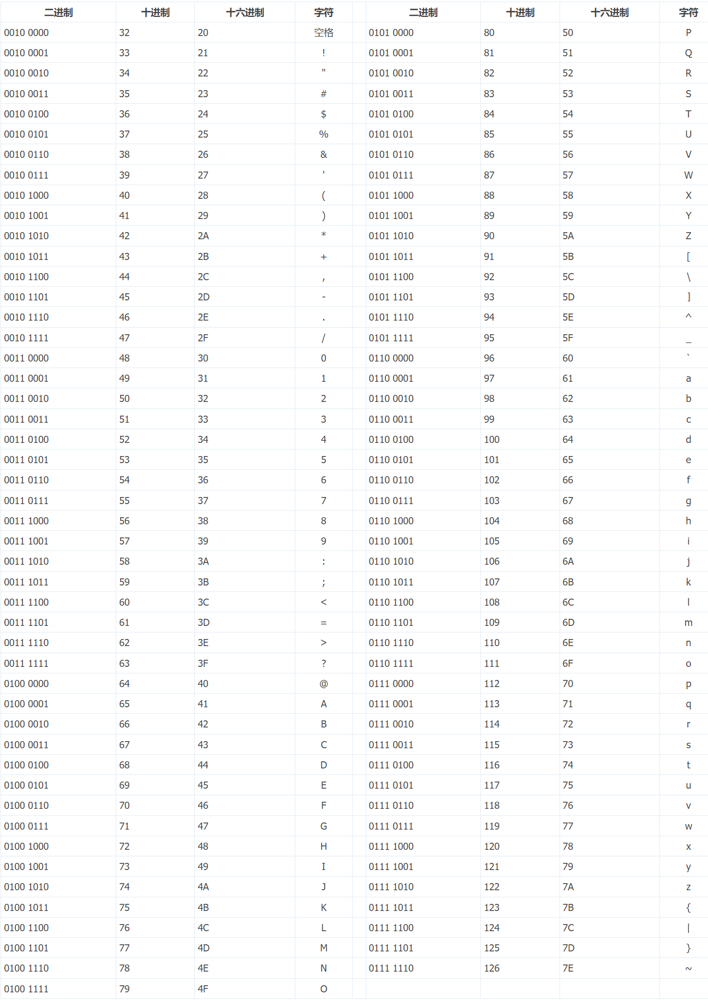
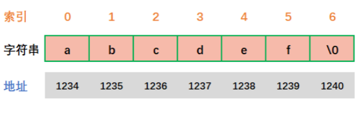
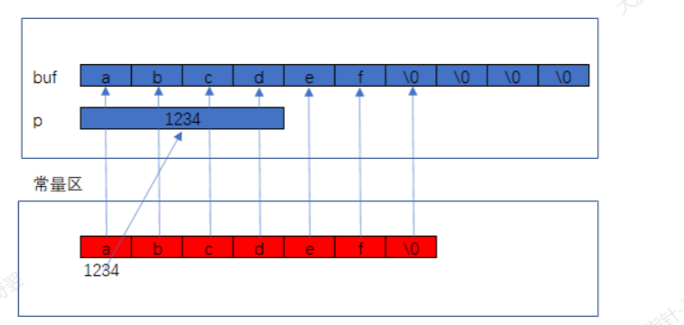

# 字符串

# 1.字符常量

---

> **'a'       'b'       'c'       '5'**

## 1.1 ASCII

ASCII 字符表上的数字 0~31 以及 127（共 33 个）分配给了控制字符，用于控制像打印机等一些外围设备：

|**二进制**|**十进制**|**十六进制**|**缩写**|**含义**|
| -----------| -----| ----| -----| -------------------------------------|
|0000 0000|0|00|NUL|空字符|
|0000 0001|1|01|SOH|标题开始|
|0000 0010|2|02|STX|文本开始|
|0000 0011|3|03|ETX|文本结束|
|0000 0100|4|04|EOT|传输结束|
|0000 0101|5|05|ENQ|请求|
|0000 0110|6|06|ACK|确认响应|
|0000 0111|7|07|BEL|响铃|
|0000 1000|8|08|BS|退格|
|0000 1001|9|09|HT|水平制表符|
|0000 1010|10|0A|LF|换行符|
|0000 1011|11|0B|VT|垂直制表符|
|0000 1100|12|0C|FF|换页符|
|0000 1101|13|0D|CR|回车键|
|0000 1110|14|0E|SO|取消变换（Shift out）|
|0000 1111|15|0F|SI|启动变换（Shift in）|
|0001 0000|16|10|DLE|数据链路转义|
|0001 0001|17|11|DC1|设备控制一（XON 激活软件速度控制）|
|0001 0010|18|12|DC2|设备控制二|
|0001 0011|19|13|DC3|设备控制三（XOFF 停用软件速度控制）|
|0001 0100|20|14|DC4|设备控制四|
|0001 0101|21|15|NAK|拒绝接收|
|0001 0110|22|16|SYN|同步空闲|
|0001 0111|23|17|ETB|区块传输结束|
|0001 1000|24|18|CAN|取消|
|0001 1001|25|19|EM|连接介质中断|
|0001 1010|26|1A|SUB|替换|
|0001 1011|27|1B|ESC|退出键|
|0001 1100|28|1C|FS|文件分区符|
|0001 1101|29|1D|GS|组群分隔符|
|0001 1110|30|1E|RS|记录分隔符|
|0001 1111|31|1F|US|单元分隔符|
||||||
|0111 1111|127|7F|DEL|删除|

字符表上的数字 32~126 分配给了能在键盘上找到的字符，当您查看或打印文档时就会出现：

​

## 1.2 转义字符

​`printf("a = %%d", 3);// a = %d`​​

```c
#include <stdio.h>

int main(){
    char c = '\n';
    printf("%c", c);
    c = '\'';
    printf("%c", c);
    c = '\t';
    printf("%c", c);
    c = '\\';
    printf("%c", c);
    c = '\a';
    printf("%c", c);
    return 0;
}
```

## 1.3 0        '0'       '\0'的区别

> '0'    ==    48
>
> '\0'   ==    0   空字符

# 2. 字符串常量

> &quot;abcdef&quot;            &quot;123456&quot;

## 2.1 "xxx" 表示的是字符串首字符的地址

## 2.2 为什么char*存储字符串

                  ​

```c
#include <stdio.h>

int main() {
    char *p = "abcdef"; // 地址存放到指针变量中
    p++;
    printf("%c", *p); // b
    return 0;
}
```

## 2.3 计算字符串的长度

```c
#include <stdio.h>
#include <string.h>

int main() {
    char *p = "\\\a\0\n\012a0";
    printf("%d ", sizeof(p));                // 4
    printf("%d ", sizeof("\\\a\0\n\012a0")); // 8
    int n = strlen(p);
    printf("%d ", n); // 2
    p++;
    p++;
    p++;
    n = strlen(p);
    printf("%d ", n); // 4
    return 0;
}
```

# 3.字符数组和字符串常量的区别

---

## 3.1 常量区

不可用修改

* 整形常量      ​ 10     123      -1234     0
* 浮点常量        1.234            1.111
* 字符常量        ​ 'a'              '8'
* 字符串常量           &quot;abcdef&quot;
* 地址常量              &amp;a      数组名       函数名

## 3.2 字符数组和字符串常量

​​

```c
#include <stdio.h>
#include <string.h>

int main() {
    char buf[10] = "abcdef";
    char *p = "abcdef";
    (*buf)++;
    (*p)++; // 字符常量不可修改
    return 0;
}
```

**const**

```c
#include <stdio.h>
#include <string.h>

int main() {
    char a = 'a';
    char b = 'b';
    const char *pa = &a; //*pa不可修改
    pa = &b;
    *pa = 'c';
    char const *pb = &a; //*pb不可修改
    pb = &a;
    *pb = 'c';
    char *const pc = &a; // pc不可修改
    pc = &b;
    *pc = 'c';
    const char *const pd = &a; //都不可修改
    pd = &b;
    *pd = 'c';
    return 0;
}
```

* const如果在\*左， 那么指针变量可以修改,\*指针变量不可以修改
* const如果在\*右， 那么指针变量不可以修改，\*指针变量可以修改

**strlen源码**

```c
size_t strlen(const char *str) {
    const char *eos = str;
    while(*eos++);
    return (end - str - 1);
}
```

> size_t 表示的是 unsigned int

空指针

指针变量的值为NULL(0), 禁止访问空指针

<u>NULL可以为任意指针赋值</u>

```c
#include <stdio.h>
#include <string.h>
#include <assert.h>

unsigned int m_strlen(char const *str) {
    // if (str == NULL){
    // return 0;
    //}
    assert(str); // 断言
    unsigned int n = 0;
    while (*str != '\0') {
        str++;
        n++;
    }
    return n;
}

int main() {
    char p[100] = "";
    scanf("%s", p);
    int n = m_strlen(p);
    printf("%d", n);
    return 0;
}
```

**Debug 和 Release模式区别**

1. Release 对程序优化了，执行效率更高

2. Debug针对程序员使用， 可以方便调试
